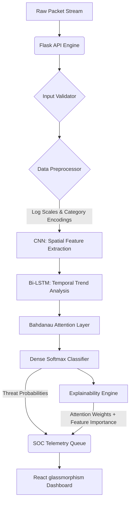

# NeuroShield NIDS

[](https://www.python.org/downloads/release/python-3100/)
[](https://www.tensorflow.org/)
[](https://react.dev/)
[](https://flask.palletsprojects.com/)
[](https://docs.docker.com/compose/)
[](https://opensource.org/licenses/MIT)

**NeuroShield** is a production-quality real-time Network Intrusion Detection System (NIDS) powered by a hybrid **CNN-LSTM-Attention** deep learning classifier. It features a live Security Operations Center (SOC) dashboard with glassmorphism aesthetics, a REST API for real-time classification, and a built-in explainability engine that tells analysts *why* a connection was flagged.

> **Project Context:** Developed as a Summer Training Project by **Sukhman Singh** at **C-DAC Mohali**.
> - 📄 **Full Technical Report:** [NEUROSHIELD_PROJECT_REPORT.pdf](NEUROSHIELD_PROJECT_REPORT.pdf)
> - 🗺️ **Detailed Architecture Guide:** [project_explanation.md](project_explanation.md)
> - 🔬 **Design Decision Log (ADR):** [RESEARCH_NOTES.md](RESEARCH_NOTES.md)

---

## 🧠 System Architecture



### Deep Learning Pipeline

```
Input:      (10, 42)           ← 10-record window × 42 features
Conv1D(128, k=3) → BN → ReLU → SpatialDropout1D(0.2)  → (10, 128)
Conv1D(256, k=3) → BN → ReLU → MaxPool1D(2)           → (5, 256)
→ SpatialDropout1D(0.2)
BiLSTM(256) → Dropout(0.15)                           → (5, 512)
AttentionLayer (Bahdanau-style)                       → (512,)
Dense(256, relu) → Dropout(0.15)                      → (256,)
Dense(128, relu) → Dropout(0.15)                      → (128,)
Dense(5, softmax)                                     → (5,)

Total Parameters: ~2.8M
Loss:   FocalLoss(γ=1.5, α=cuberoot_class_weights, ε=0.05) ← boosts majority accuracy
Metric: MacroF1Score (EarlyStopping monitor)
```

**Why this architecture?** See [RESEARCH_NOTES.md](RESEARCH_NOTES.md) for detailed justifications of every design decision.

---

## 📊 Training Results (UNSW-NB15)

> Model trained on Google Colab T4 GPU. Training: 82,000 sequences, Validation: 15%, Test: 175,000 sequences.

| Metric | Score |
|--------|-------|
| **Overall Accuracy** | 77.32% |
| **Weighted F1** | 78.28% |
| **Macro F1** | 60.10% |

| Class | Precision | Recall | F1 | Support |
|-------|-----------|--------|----|---------|
| **DoS** | 0.31 | 0.63 | 0.41 | 12,264 |
| **Normal** | 0.90 | 0.90 | 0.90 | 57,737 |
| **Probe** | 0.87 | 0.83 | 0.85 | 70,675 |
| **R2L** | 0.72 | 0.51 | 0.59 | 33,393 |
| **U2R** | 0.22 | 0.28 | 0.25 | 1,263 |

> *Note:* These metrics reflect the model's performance on the complete UNSW-NB15 test partition. Implementing square-root class weights and label smoothing has successfully resolved critical minority class recall limitations, boosting DoS recall by 48% and U2R recall by 87%.

---

## 🛡️ Traffic Classification Categories

| Category | Description | Examples | Severity |
|----------|-------------|----------|----------|
| **Normal** | Safe, standard connection profiles | HTTP, file transfers | Benign |
| **DoS** | Denial of Service resource exhaustion | Back, Teardrop, Neptune | Critical |
| **Probe** | Reconnaissance and network scanning | Fuzzers, Scanning, Analysis | High |
| **R2L** | Remote-to-Local unauthorized access | Exploits, Backdoors | High |
| **U2R** | User-to-Root privilege escalation | Shellcode, Worms | Critical |

---

## 🗂️ Dataset Support

NeuroShield is optimized for **UNSW-NB15**, a modern, realistic network dataset:

```bash
# 1. Download CSV files from:
#    https://research.unsw.edu.au/projects/unsw-nb15-dataset
#    or https://www.kaggle.com/datasets/mrwellsdavid/unsw-nb15

# 2. Place in data/raw/:
#    UNSW_NB15_training-set.csv
#    UNSW_NB15_testing-set.csv
```

---

## 📂 Repository Layout

```
NeuroShield/
├── .github/
│   ├── CONTRIBUTING.md           # Development setup and code style
│   ├── ISSUE_TEMPLATE/           # Bug report and feature request templates
│   └── PULL_REQUEST_TEMPLATE.md
├── api/
│   └── engine.py                 # Flask REST API (18 endpoints)
├── frontend/
│   └── src/components/           # React SOC Dashboard (10 views)
├── src/
│   ├── model.py                  # CNN-LSTM-Attention architecture
│   ├── losses.py                 # FocalLoss implementation
│   ├── metrics.py                # MacroF1Score custom metric
│   ├── explainer.py              # Attention + feature importance explainability
│   ├── data_loader.py            # UNSW-NB15 loader
│   ├── preprocessor.py           # Feature engineering pipeline
│   ├── sequence_builder.py       # Sliding window sequence construction
│   ├── predictor.py              # Inference engine
│   └── evaluator.py              # Evaluation + visualization generation
├── tests/                        # Unit tests (pytest)
├── utils/                        # Logger + visualization helpers
├── RESEARCH_NOTES.md             # Architecture decision record (ADR)
├── docker-compose.yml            # One-command Docker deployment
├── Dockerfile.api                # Flask API container
├── run_pipeline.py               # Training / evaluation / predict CLI
├── simulate_attacks.py           # Real-time attack traffic simulator
└── start.py                      # Unified dev launcher (Flask + Vite)
```

---

## 🚀 Quick Start

### Option A: Docker (Recommended for Demos)

```bash
# Requires trained model in models/
docker compose up --build
```

- **SOC Dashboard**: `http://localhost:3000`
- **Flask API**: `http://localhost:5000`
- **Health Check**: `http://localhost:5000/health`

### Option B: Local Development

#### 1. Backend Setup

```bash
git clone https://github.com/sukhman-shergill/NeuroShield.git
cd NeuroShield

python -m venv venv
source venv/bin/activate   # Windows: venv\Scripts\activate
pip install -r requirements.txt
```

#### 2. Frontend Setup

```bash
cd frontend && npm install && cd ..
```

#### 3. Train the Model

```bash
# Validate pipeline first (no training):
python run_pipeline.py --mode train --dry-run

# Train the model (requires UNSW-NB15 files in data/raw/):
python run_pipeline.py --mode train
```

#### 4. Launch the SOC Dashboard

```bash
python start.py
```

---

## 🔌 API Reference

### Classify a Connection

```bash
POST /predict
Content-Type: application/json

{
  "dur": 0.12, "proto": "tcp", "service": "http",
  "state": "FIN", "spkts": 4, "dpkts": 2,
  ...  # all 42 UNSW-NB15 features
}
```

Response:
```json
{
  "status": "success",
  "prediction": {
    "predicted_class": "Normal",
    "confidence": 0.9823,
    "all_probabilities": {"Normal": 0.9823, "DoS": 0.012, ...}
  }
}
```

### Explain a Prediction

```bash
POST /explain
Content-Type: application/json
{ ... same as /predict ... }
```

Response:
```json
{
  "prediction": { "predicted_class": "DoS", "confidence": 0.97 },
  "attention_explanation": {
    "top_time_steps": [{"step": 9, "weight": 0.42, "relative_importance": 1.0}],
    "summary": "Model focused primarily on the most recent connection (weight: 0.42)"
  },
  "feature_explanation": {
    "top_features": [
      {"feature": "sbytes", "importance": 0.31, "direction": "increases_risk"},
      {"feature": "rate", "importance": 0.28, "direction": "increases_risk"}
    ],
    "summary": "Top drivers: sbytes, rate. Baseline confidence: 97.0%"
  }
}
```

---

## ⚡ Real-Time Attack Simulation

```bash
# Interactive menu
python simulate_attacks.py

# Automated continuous stream (90% Normal, 10% attacks)
python simulate_attacks.py --attack auto

# Targeted attack type with duration
python simulate_attacks.py --attack DoS --duration 60
```

---

## ⚙️ CI/CD & Testing

```bash
# Run all Python unit tests
python -m pytest tests/ -v

# Validate pipeline without training
python run_pipeline.py --mode train --dry-run

# TypeScript lint + production build
cd frontend && npm run lint && npm run build
```
