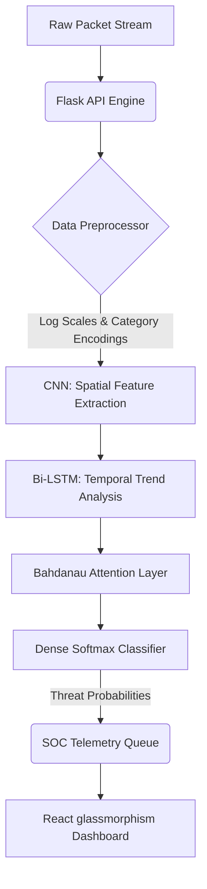

# NeuroShield NIDS

[](https://www.python.org/downloads/release/python-3100/)
[](https://www.tensorflow.org/)
[](https://react.dev/)
[](https://flask.palletsprojects.com/)
[](https://opensource.org/licenses/MIT)

**NeuroShield** is an advanced real-time Network Intrusion Detection System (NIDS) powered by a hybrid **CNN-LSTM-Attention** deep learning classifier. It features a responsive Security Operations Center (SOC) dashboard utilizing modern glassmorphism aesthetics for real-time network monitoring, threat detection and automated host isolation.

> **Project Context:** This system was developed as a Summer Training Project by **Sukhman Singh** at **C-DAC Mohali**. For the full technical breakdown, see [NEUROSHIELD_PROJECT_REPORT.pdf](file:///c:/Users/ASUS/Documents/AI%20TOOLS/cdac-project/NEUROSHIELD_PROJECT_REPORT.pdf).

---

## 🧠 System Architecture

NeuroShield intercepts network connection packets and pipes them through a multi-stage deep learning model to classify traffic into five distinct security categories.



### Deep Learning Pipeline Overview
1. **CNN Block (Spatial Feature Extraction)**: A sequence of `Conv1D` layers combined with Batch Normalization and Spatial Dropout captures localized correlation coefficients and spatial pattern structures from connection statistics.
2. **LSTM Block (Temporal Sequence Learning)**: A `Bidirectional LSTM` layer stacked with a standard `LSTM` layer processes sequences of consecutive connection events. This enables the model to identify slow-burning attacks that span multiple connection records.
3. **Bahdanau-style Attention Mechanism**: A custom attention layer evaluates the relative importance of each time step in the connection sequence and constructs a weighted context vector focusing on the critical indicators of intrusion.
4. **Softmax Output Head**: Projects the context vector to a probability distribution across the five target connection classes.

---

## 🛡️ Traffic Classification Categories

The detection engine classifies network traffic into five categories derived from the NSL-KDD benchmark dataset:

| Category | Description | Examples | Severity |
|----------|-------------|----------|----------|
| **Normal** | Safe, standard connection profiles | HTTP requests, safe file transfers and normal pings | Benign |
| **DoS** | Denial of Service vectors aimed at resource exhaustion | Neptune, Smurf, Back and Teardrop | Critical |
| **Probe** | Scanner attempts to discover network structures | Nmap scans, Satan port scans and IP sweeps | High |
| **R2L** | Remote-to-Local unauthorized system access attempts | Guess_passwd, FTP_write and Warez client attacks | High |
| **U2R** | User-to-Root local privilege escalation attempts | Buffer overflows, Rootkit execution and privilege leaks | Critical |

---

## 📊 Model Performance Metrics

The deep learning model was evaluated on the independent **NSL-KDD** test partition (`KDDTest+`), yielding the following performance metrics:

- **Overall Test Accuracy**: `80.82%`
- **Weighted F1-Score**: `79.96%`

### Detailed Classification Report

| Traffic Category | Precision | Recall | F1-Score | Support |
|------------------|-----------|--------|----------|---------|
| **Normal** | `95.38%` | `79.99%` | `87.01%` | 7,456 |
| **DoS** | `75.10%` | `95.17%` | `83.95%` | 9,707 |
| **Probe** | `74.50%` | `79.09%` | `76.73%` | 2,420 |
| **R2L** | `90.32%` | `36.88%` | `52.38%` | 2,885 |
| **U2R** | `14.10%` | `49.25%` | `21.93%` | 67 |

> [!NOTE]
> The lower F1-score for Remote-to-Local (R2L) and User-to-Root (U2R) classes represents a known characteristic of the NSL-KDD dataset due to high class imbalance in the training partitions.

---

## 📂 Repository Layout

```
NeuroShield/
├── .github/workflows/    # CI pipelines (Python tests and Vite compilation checks)
├── api/                  # Flask REST API endpoints and telemetry manager
├── frontend/             # React/TypeScript Vite web application (SOC Dashboard)
├── models/               # Saved model weights, scaler configuration and encoders
├── src/                  # Core machine learning classes (model, builder and processor)
├── tests/                # Automated unit tests for preprocessors and sequence builders
├── utils/                # Logging utilities and visualization helpers
├── start.py              # Unified launcher for frontend and backend servers
├── run_pipeline.py       # Full training, evaluation and visualization pipeline CLI
└── simulate_attacks.py   # Traffic simulator for attack scenarios
```

---

## 🚀 Installation & Quick Start

### Prerequisites
- **Python 3.10** or higher
- **Node.js 18** or higher (with npm)
- *Optional:* CUDA-capable NVIDIA GPU for accelerated deep learning inference

### 1. Backend Environment Setup
Clone the repository and install the Python dependencies:
```bash
git clone https://github.com/sukhman-shergill/NeuroShield.git
cd NeuroShield

# Setup virtual environment
python -m venv venv
source venv/bin/activate  # On Windows: venv\Scripts\activate

# Install requirements
pip install -r requirements.txt
```

### 2. Frontend Environment Setup
Navigate to the frontend directory and install the Node.js packages:
```bash
cd frontend
npm install
cd ..
```

### 3. Running the NIDS
Start both the backend API and the frontend dashboard servers simultaneously with the unified launch script:
```bash
python start.py
```
- **React Frontend:** available at `http://localhost:3000`
- **Flask API Backend:** available at `http://localhost:5000`

---

## ⚡ Real-Time Attack Simulation

To showcase the real-time detection capabilities of NeuroShield, you can simulate connection flows against the engine:

1. Open a separate terminal window and run:
   ```bash
   python simulate_attacks.py
   ```
2. Select **Option 6 (Auto-mode)** to generate a continuous stream of mixed network connections.
3. Observe the live charts, attack warning alerts and packet inspectors updating dynamically on the dashboard at `http://localhost:3000`.

---

## ⚙️ CI/CD & Testing

This project incorporates a GitHub Actions workflow `.github/workflows/ci.yml` that automatically:
- Installs Python dependencies and runs backend unit tests via `unittest` on push and pull requests.
- Validates the React typescript code compilation and verifies the Vite production bundle builds successfully.

To run the unit tests locally, execute:
```bash
python -m unittest discover -s tests
```
